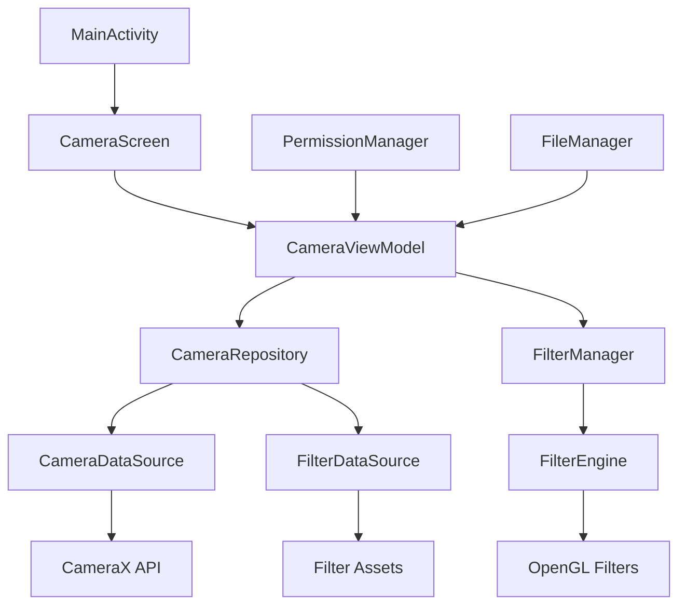

# Design Document

## Overview

The camera-first UI feature transforms the existing Android Compose application into a photography-focused experience. The design leverages Android's CameraX library for camera functionality, Jetpack Compose for UI, and follows the existing project's clean architecture pattern with MVVM and dependency injection using Hilt.

The solution provides an immersive full-screen camera experience with real-time filter preview capabilities, eliminating navigation distractions to focus purely on photography.

## Architecture

### High-Level Architecture



### Layer Responsibilities

**Presentation Layer:**
- `CameraScreen`: Full-screen camera UI with filter controls
- `CameraViewModel`: State management and business logic coordination
- `FilterSelectionBottomSheet`: Filter selection interface

**Domain Layer:**
- `CameraRepository`: Camera operations abstraction
- `FilterRepository`: Filter management abstraction
- Use cases for camera operations, filter application, and photo capture

**Data Layer:**
- `CameraDataSource`: CameraX integration
- `FilterDataSource`: Filter assets and metadata management
- `PhotoStorageDataSource`: Photo saving and gallery integration

## Components and Interfaces

### Core Components

#### 1. CameraScreen Composable
```kotlin
@Composable
fun CameraScreen(
    viewModel: CameraViewModel = hiltViewModel(),
    onNavigateBack: () -> Unit = {}
)
```

**Responsibilities:**
- Full-screen camera preview display
- Camera controls overlay (capture button, filter icon)
- Filter selection UI integration
- Permission handling UI

#### 2. CameraViewModel
```kotlin
@HiltViewModel
class CameraViewModel @Inject constructor(
    private val cameraRepository: CameraRepository,
    private val filterRepository: FilterRepository,
    private val permissionManager: PermissionManager
) : ViewModel()
```

**State Management:**
- Camera preview state
- Filter selection state
- Permission status
- Capture operation status
- Error handling

#### 3. CameraRepository Interface
```kotlin
interface CameraRepository {
    suspend fun initializeCamera(): Result<Unit>
    suspend fun capturePhoto(filter: Filter?): Result<Uri>
    suspend fun switchCamera(): Result<Unit>
    fun getCameraPreview(): Flow<CameraPreviewState>
    suspend fun applyFilter(filter: Filter): Result<Unit>
}
```

#### 4. FilterManager
```kotlin
class FilterManager @Inject constructor(
    private val filterEngine: FilterEngine,
    private val filterDataSource: FilterDataSource
) {
    suspend fun getAvailableFilters(): List<Filter>
    suspend fun applyFilter(filter: Filter, preview: SurfaceView): Result<Unit>
    suspend fun removeFilter(): Result<Unit>
}
```

### UI Components

#### 1. CameraPreview
```kotlin
@Composable
fun CameraPreview(
    modifier: Modifier = Modifier,
    onPreviewReady: (PreviewView) -> Unit
)
```

#### 2. CameraControls
```kotlin
@Composable
fun CameraControls(
    onCaptureClick: () -> Unit,
    onFilterClick: () -> Unit,
    onSwitchCamera: () -> Unit,
    isCapturing: Boolean,
    modifier: Modifier = Modifier
)
```

#### 3. FilterSelectionSheet
```kotlin
@Composable
fun FilterSelectionSheet(
    filters: List<Filter>,
    selectedFilter: Filter?,
    onFilterSelected: (Filter) -> Unit,
    onDismiss: () -> Unit,
    isVisible: Boolean
)
```

## Data Models

### Core Models

#### Camera Models
```kotlin
data class CameraPreviewState(
    val isInitialized: Boolean = false,
    val isPreviewActive: Boolean = false,
    val currentCamera: CameraSelector = CameraSelector.DEFAULT_BACK_CAMERA,
    val error: String? = null
)

data class CaptureState(
    val isCapturing: Boolean = false,
    val lastCapturedPhoto: Uri? = null,
    val error: String? = null
)
```

#### Filter Models
```kotlin
data class Filter(
    val id: String,
    val name: String,
    val thumbnailRes: Int,
    val type: FilterType,
    val intensity: Float = 1.0f,
    val parameters: Map<String, Any> = emptyMap()
)

enum class FilterType {
    NONE,
    VINTAGE,
    BLACK_WHITE,
    SEPIA,
    VIVID,
    COOL,
    WARM,
    DRAMATIC
}

data class FilterState(
    val availableFilters: List<Filter> = emptyList(),
    val selectedFilter: Filter? = null,
    val isApplying: Boolean = false,
    val error: String? = null
)
```

### UI State Models
```kotlin
data class CameraUiState(
    val cameraState: CameraPreviewState = CameraPreviewState(),
    val filterState: FilterState = FilterState(),
    val captureState: CaptureState = CaptureState(),
    val permissionState: PermissionState = PermissionState(),
    val isFilterSheetVisible: Boolean = false
)

data class PermissionState(
    val hasCameraPermission: Boolean = false,
    val hasStoragePermission: Boolean = false,
    val shouldShowRationale: Boolean = false
)
```

## Error Handling

### Error Categories

#### 1. Camera Errors
```kotlin
sealed class CameraError : Exception() {
    object CameraNotAvailable : CameraError()
    object CameraAccessDenied : CameraError()
    object CameraInitializationFailed : CameraError()
    data class CaptureError(val reason: String) : CameraError()
}
```

#### 2. Filter Errors
```kotlin
sealed class FilterError : Exception() {
    object FilterNotFound : FilterError()
    object FilterApplicationFailed : FilterError()
    data class FilterLoadError(val filterId: String) : FilterError()
}
```

#### 3. Permission Errors
```kotlin
sealed class PermissionError : Exception() {
    object CameraPermissionDenied : PermissionError()
    object StoragePermissionDenied : PermissionError()
    object PermissionPermanentlyDenied : PermissionError()
}
```

### Error Handling Strategy

**User-Facing Errors:**
- Permission denied: Show permission request dialog
- Camera unavailable: Display error message with retry option
- Capture failed: Show toast with retry option
- Filter application failed: Revert to previous filter

**Technical Errors:**
- Log detailed error information using Timber
- Report crashes to analytics (if implemented)
- Graceful degradation where possible

## Testing Strategy

### Unit Testing

#### ViewModel Testing
```kotlin
@Test
fun `when capture photo called, should update capture state`() {
    // Given
    val mockRepository = mockk<CameraRepository>()
    every { mockRepository.capturePhoto(any()) } returns flowOf(Result.success(mockUri))
    
    // When
    viewModel.capturePhoto()
    
    // Then
    verify { mockRepository.capturePhoto(any()) }
    assertEquals(false, viewModel.uiState.value.captureState.isCapturing)
}
```

#### Repository Testing
```kotlin
@Test
fun `when initialize camera called, should return success`() = runTest {
    // Given
    val dataSource = mockk<CameraDataSource>()
    coEvery { dataSource.initializeCamera() } returns Result.success(Unit)
    
    // When
    val result = repository.initializeCamera()
    
    // Then
    assertTrue(result.isSuccess)
}
```

### Integration Testing

#### Camera Integration Tests
```kotlin
@Test
fun `camera preview should display when permissions granted`() {
    // Test camera preview initialization with granted permissions
}

@Test
fun `filter application should update preview in real-time`() {
    // Test filter application and preview update
}
```

### UI Testing

#### Compose UI Tests
```kotlin
@Test
fun `camera screen should show capture button`() {
    composeTestRule.setContent {
        CameraScreen()
    }
    
    composeTestRule
        .onNodeWithContentDescription("Capture photo")
        .assertIsDisplayed()
}

@Test
fun `filter sheet should open when filter button clicked`() {
    composeTestRule.setContent {
        CameraScreen()
    }
    
    composeTestRule
        .onNodeWithContentDescription("Select filter")
        .performClick()
    
    composeTestRule
        .onNodeWithText("Filters")
        .assertIsDisplayed()
}
```

### Performance Testing

#### Camera Performance
- Preview latency measurement
- Filter application performance
- Memory usage monitoring
- Battery consumption testing

#### UI Performance
- Compose recomposition tracking
- Frame rate monitoring during filter application
- Touch response latency

## Implementation Considerations

### Dependencies Required

Add to `app/build.gradle.kts`:
```kotlin
// Camera
implementation "androidx.camera:camera-core:1.3.1"
implementation "androidx.camera:camera-camera2:1.3.1"
implementation "androidx.camera:camera-lifecycle:1.3.1"
implementation "androidx.camera:camera-view:1.3.1"
implementation "androidx.camera:camera-extensions:1.3.1"

// Permissions
implementation "com.google.accompanist:accompanist-permissions:0.32.0"

// Image processing (for filters)
implementation "androidx.renderscript:renderscript-toolkit:1.0.0"
```

### Permissions Required

Add to `AndroidManifest.xml`:
```xml
<uses-permission android:name="android.permission.CAMERA" />
<uses-permission android:name="android.permission.WRITE_EXTERNAL_STORAGE" 
    android:maxSdkVersion="28" />
<uses-permission android:name="android.permission.READ_EXTERNAL_STORAGE" 
    android:maxSdkVersion="32" />
<uses-permission android:name="android.permission.READ_MEDIA_IMAGES" />

<uses-feature android:name="android.hardware.camera" android:required="true" />
<uses-feature android:name="android.hardware.camera.autofocus" />
```

### Performance Optimizations

#### Camera Optimization
- Use appropriate preview resolution based on device capabilities
- Implement camera lifecycle management to prevent resource leaks
- Optimize filter rendering using GPU acceleration where possible

#### Memory Management
- Implement proper bitmap recycling for filter previews
- Use object pooling for frequently created objects
- Monitor memory usage during filter application

#### Battery Optimization
- Pause camera when app goes to background
- Optimize filter processing algorithms
- Use efficient image formats for capture and storage

### Security Considerations

#### Privacy Protection
- Clear camera preview when app loses focus
- Secure photo storage with appropriate permissions
- No unauthorized access to camera or photos

#### Data Protection
- Encrypt sensitive camera metadata if stored
- Secure handling of photo file paths
- Proper cleanup of temporary files

This design provides a comprehensive foundation for implementing the camera-first UI feature while maintaining the existing project's architecture patterns and ensuring optimal performance and user experience.